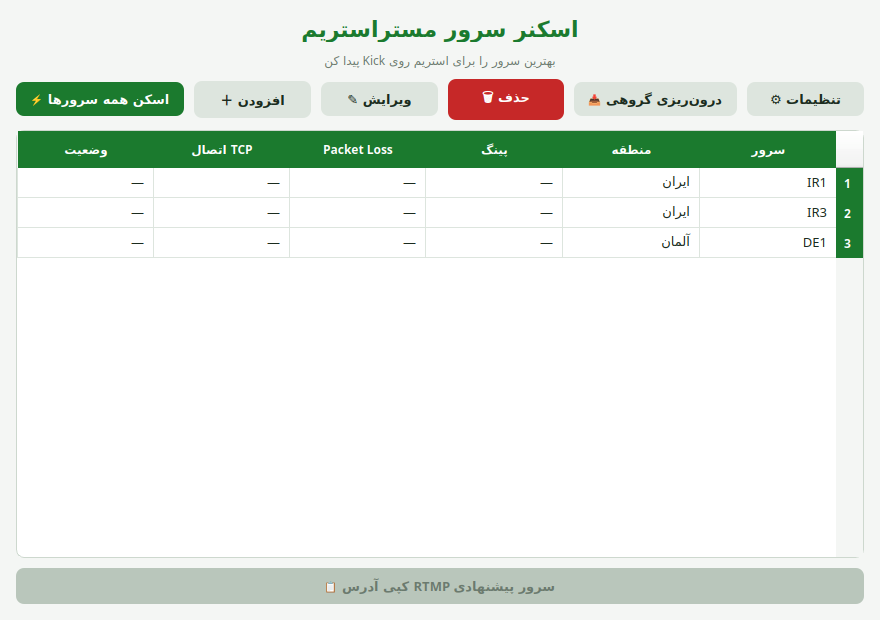

# StreamScanner


Find the **best MasterStream ingest server** for streaming to **Kick** — measured from
*your own* connection, not from a public dashboard.



> **Note:** This is an independent community tool. It is **not affiliated with,
> endorsed by, or sponsored by MasterStream**.

---

## Why?

Public uptime dashboards show how servers look *from their probes*. Your stream
quality depends on how servers look **from your ISP**. This app pings every
server and measures TCP connection time to the RTMP port — all in parallel —
then ranks them and recommends the best one for your Kick stream.

## Features

- ⚡ **Parallel scan** — all servers probed at the same time, no console windows
- 🔍 **Auto-detect** — paste an RTMP link and the server name + region are filled in automatically
- 🏆 **Smart ranking** — best server recommendation based on latency, packet loss and TCP connect time
- 🎨 **Themes** — dark, light, or follow the system
- 🔔 **Auto-update** — checks GitHub releases and installs new versions in-app
- 📥 **Bulk import** — paste many servers at once (`name | rtmp://host:1935/live`)
- 📋 **One-click copy** — copy the recommended server's RTMP address for Meld / OBS
- 🇮🇷 Persian RTL interface

## Download & Install

Download the latest **`StreamScanner-Setup.exe`** from the
[Releases page](https://github.com/thaarfknight-star/StreamScanner/releases)
and run it. No Python or extra dependencies needed.

## Usage

1. Copy your ingest RTMP URLs from the MasterStream panel.
2. In the app: **＋ افزودن** (Add) or **📥 درون‌ریزی گروهی** (bulk import) to add them.
   Name and region are auto-detected from the link — edit if needed.
3. Hit **⚡ اسکن همه سرورها** (Scan all). The best server is highlighted and its
   RTMP address can be copied straight into Meld or OBS.

Settings (**⚙ تنظیمات**) let you switch themes and control update checks.
Your servers are stored locally in `servers.json` next to the app.

## Auto-update

On launch (and from Settings) the app checks the latest GitHub release.
If a newer version exists, it offers to download and install it automatically.

## Build from source

```bash
pip install -r requirements.txt
python streamscanner.py
```

The Windows installer is built by GitHub Actions (`.github/workflows/build.yml`):
PyInstaller → NSIS setup → GitHub Release (triggered by `v*` tags).

## Tech

- Python 3.12, PySide6 (Qt) — GUI
- Raw ICMP ping (hidden, no console flash) + TCP RTMP-port probing, fully parallel
- NSIS — Windows installer

## Privacy

- Server lists and settings stay on your machine (`servers.json`).
- The only network calls the app makes are: ICMP/TCP probes to *your* servers,
  and a version check against the public GitHub releases API.

## License

This project is **source-available, not open-source**. The source code is
published for transparency and reference only — copying, modification,
redistribution, or reuse is prohibited without prior written permission.
See the [LICENSE](LICENSE) file for the full terms.

Copyright (c) 2026 thaarfknight-star. All rights reserved.
